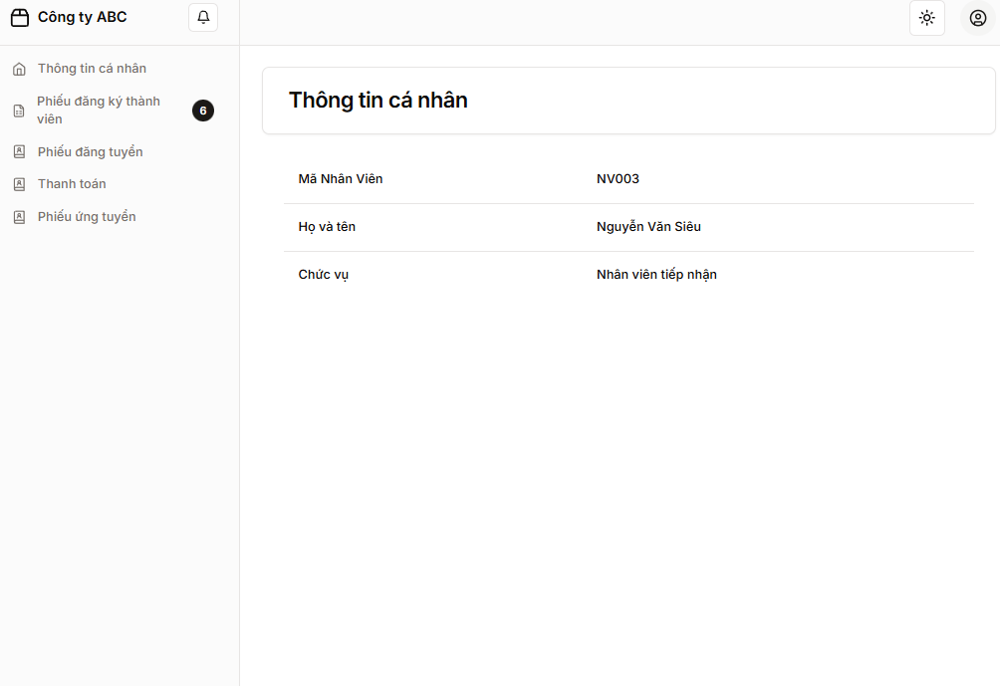
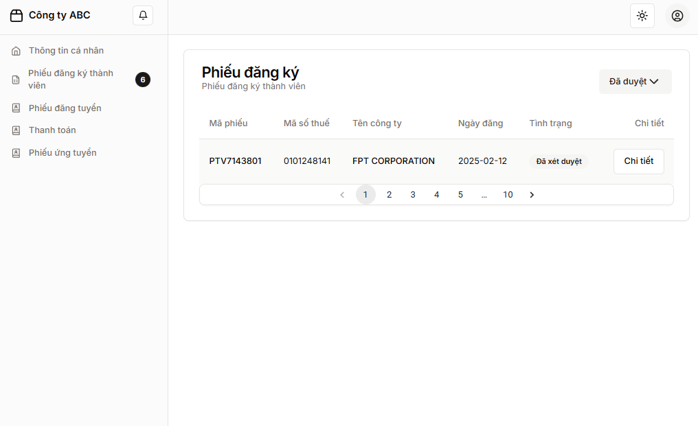
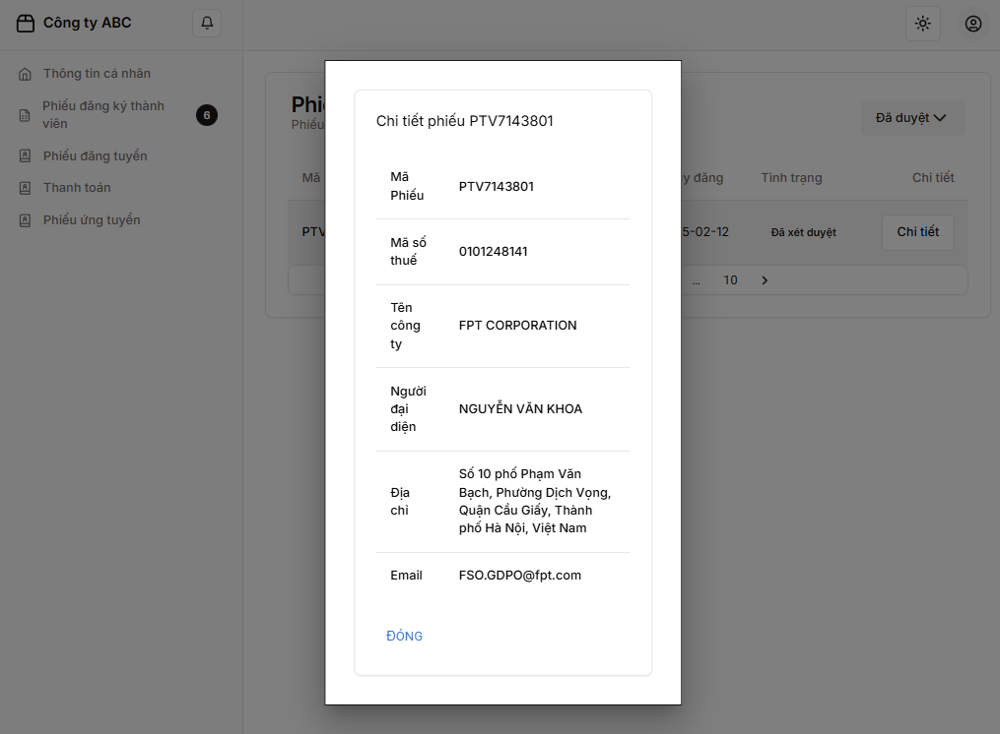
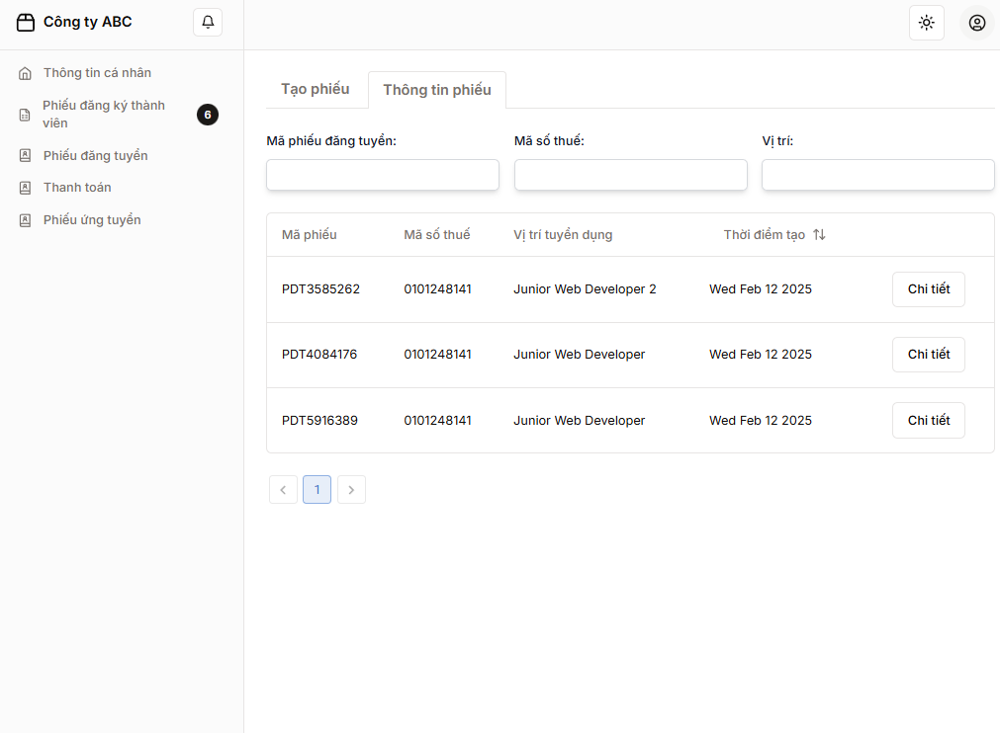
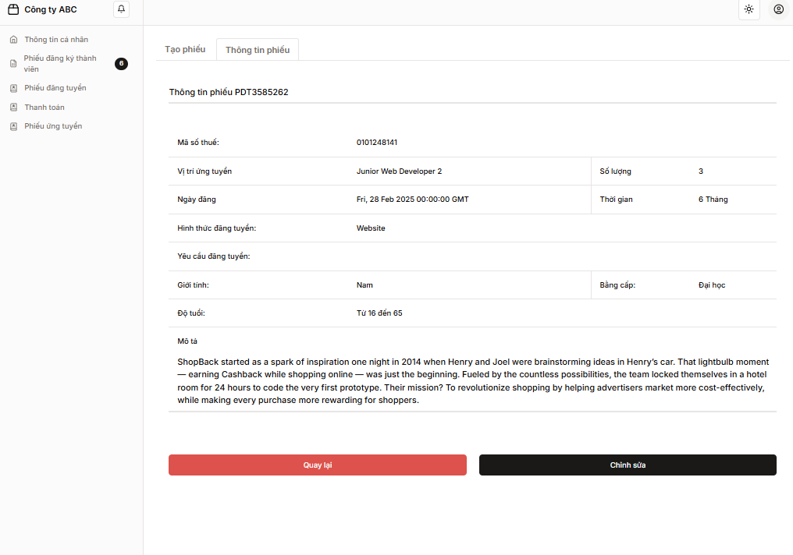
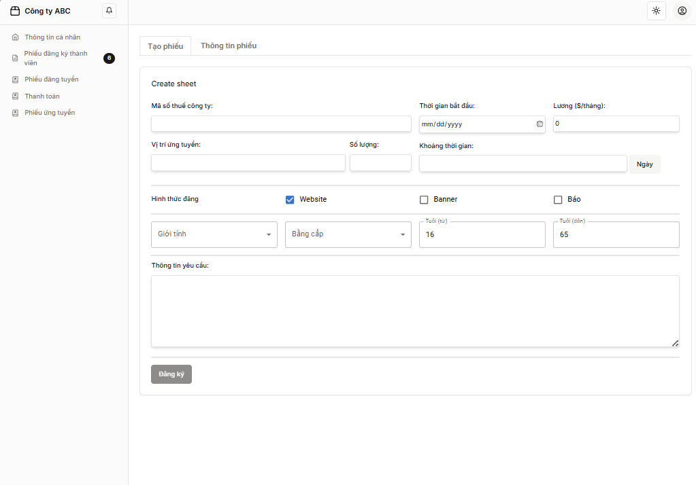
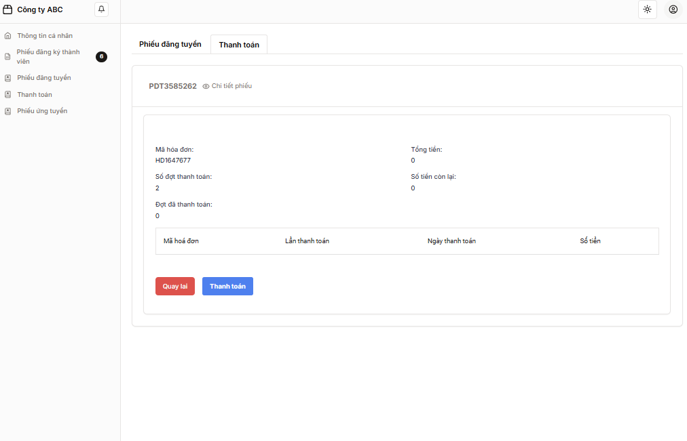

This is a [Next.js](https://nextjs.org/) project bootstrapped with [`create-next-app`](https://github.com/vercel/next.js/tree/canary/packages/create-next-app).

## Getting Started

First, run the development server:

```bash
npm run dev
# or
yarn dev
# or
pnpm dev
# or
bun dev
```

### Image demo

1. Employee info


2. Company approval


3. Company detail


4. List of job listing


5. Job listing detail 


6. Job listing creation form


7. Process payment
